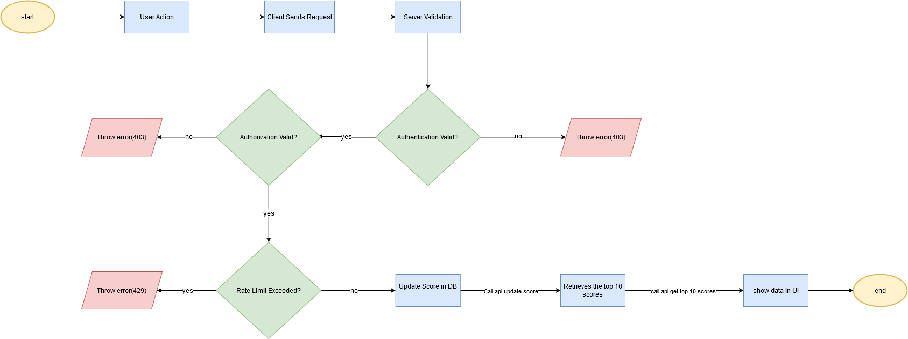

# Scoreboard API Module

## Overview
This module is designed to handle real-time updates for a website scoreboard, ensuring that user scores are updated securely and efficiently. It facilitates displaying the top 10 scores dynamically while maintaining data integrity and security against unauthorized actions.

---

## Features
1. **Live Updates**: Real-time updates of the scoreboard using WebSockets or a similar mechanism to keep all users in sync.
2. **Secure Score Updates**: Validates and authorizes all score update requests to prevent unauthorized modifications.
3. **Efficient Data Handling**: Optimized display and retrieval of the top 10 scores with minimal latency.
4. **Scalable Design**: The module supports high traffic and concurrent updates, ensuring consistent performance.
5. **Customizable Security**: Integrates JWT validation to authenticate requests securely.

---

## Database Schema
### Users Table
| Column    | Type   | Description          |
|-----------|--------|----------------------|
| userId    | String | Unique user ID       |
| userName  | String | User name            |
| score     | Int    | Current user score   |

### Scores Table (Cache)
| Column    | Type   | Description          |
|-----------|--------|----------------------|
| rank      | Int    | User rank            |
| userId    | String | User ID              |
| userName  | String | User name            |
| score     | Int    | User score           |

---

## Technology Stack
- **Backend Framework**: Node.js (Express)
- **Database**: PostgreSQL or MongoDB
- **Real-Time Updates**: WebSockets (e.g., Socket.IO)
- **Authentication**: JWT to authenticate and validate API requests
- **Caching**: Redis for top 10 scores

---

## API Endpoints
### 1. **Update User Score**
#### Endpoint
`POST /api/scores/update`

#### Description
Handles user score updates upon action completion.

#### Request Body
```json
{
  "userId": "user1",
  "actionToken": "validToken123",
  "updatedScore": 150
}
```

- `userId`: Unique identifier for the user.
- `actionToken`: Use JWT tokens for API authentication. The token will be passed in the Authorization header.

#### Response
- `200 OK`
```json
{
  "success": true,
  "message": "Score updated successfully",
  "updatedScore": 150
}
```

- `400 Bad Request`
```json
{
  "success": false,
  "error": "Invalid input."
}
```
- `401 Unauthorized`
```json
{
  "success": false,
  "error": "Missing or invalid authentication token."
}
```

- `403 Forbidden`
```json
{
  "success": false,
  "error": "Unauthorized request."
}
```

- `429 Too Many Requests`: Too many requests have been sent in a short period of time, triggering rate-limiting. The user must wait before making another request.

---

### 2. **Fetch Top Scores**
#### Endpoint
`GET /api/scores/top`

#### Description
Retrieves the top 10 scores for the scoreboard.

#### Response
- `200 OK`
```json
[
  {
    "userId": "123",
    "userName": "user1",
    "score": 2000,
    "rank": 1
  },
]
```
- `500 Internal Server Error`: Error retrieving the scoreboard.

---

## Real-Time Updates
**Mechanism**: Use WebSockets (e.g., with libraries like Socket.IO) or Server-Sent Events to broadcast updates to all connected clients whenever scores are updated.

---

## Validation & Security

1. **Request Validation**:
   - Ensure that all required fields are present and valid.
   - Validate that `userId` and `updatedScore` are legitimate.
   - Ensure that the `actionToken` (JWT) passed in the Authorization header is valid and not expired.

2. **Authentication**:
   - Use JWT for authentication. The token will be included in the `Authorization` header as `Bearer <token>`.
   - Verify the JWT using a secret key or public/private key pair to ensure that the request is coming from an authenticated user.

3. **Authorization**:
   - After validating the JWT, check if the user making the request is authorized to perform the score update.
   - Implement role-based authorization (if applicable), ensuring only users with the necessary permissions can update scores.

4. **Rate Limiting**:
   - Implement rate limiting to prevent abuse of the update endpoint.
   - Use a mechanism such as Redis to track the frequency of requests and dynamically adjust thresholds based on user behavior.

5. **Data Integrity**:
   - Use database transactions to ensure consistency in score updates and prevent race conditions.
   - Ensure that the updated score is greater than or equal to the user's current score, to prevent unauthorized score decreases.

---

## Flow Diagram
Below is the diagram illustrating the flow of execution:


---

## Improvements
1. Implement caching for top 10 scores using Redis or an equivalent to minimize database queries.
2. Enhance rate-limiting to dynamically adjust thresholds based on user behavior.
3. Add support for user notifications when their rank changes.
4. Perform periodic integrity checks to identify and rectify inconsistencies in scores.